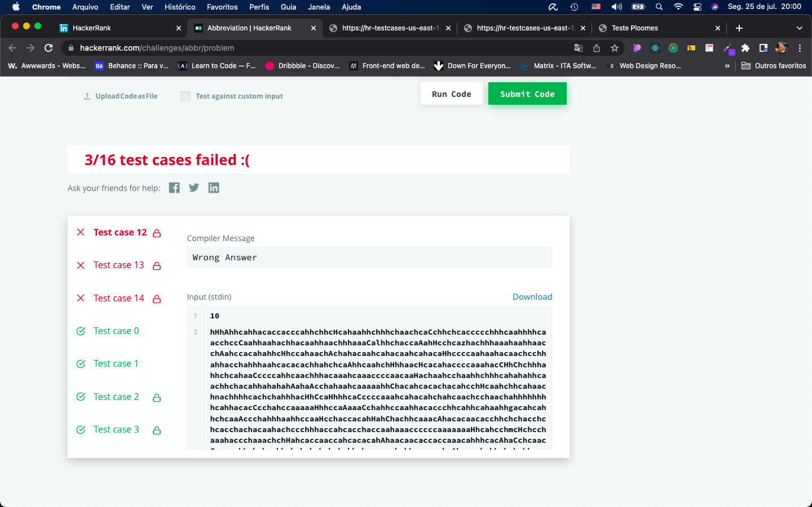

# Desafio PLOOMES HackerRank

Os dois algoritmos dos Desafios Two Characters e Abbreviation estão no arquivo script.js

## Two Characters

Este desafio foi tranquilo e consegui resolvê-lo sem problemas. Todos os testes do HackerRank foram realizados com sucesso.

## Abbreviation

Este desafio foi complicado porque nunca tinha trabalhado com programação dinâmica. Deveria ter tentado o outro mas fiquei muito envolvido nesse e, infelizmente, apenas 5 dos 16 testes foram validados durante o tempo que trabalhei nos 2 desafios (14h até 17h).

## Abbreviation (Atualização)

Trabalhei por mais 2h no código (de 18h até 20h) e consegui validar 13 dos 16 testes. Acredito que para validar todos realmente preciso aplicar programação dinâmica. Como não domino esse assunto, fui criando condicionais para conseguir obter o resultado correto na maioria dos casos possíveis. Não sei se este código atualizado contará para a avaliação mas gostaria de mostrar que eu corro atrás para atingir meus objetivos kkkk

Gostaria de agradecer a oportunidade!
