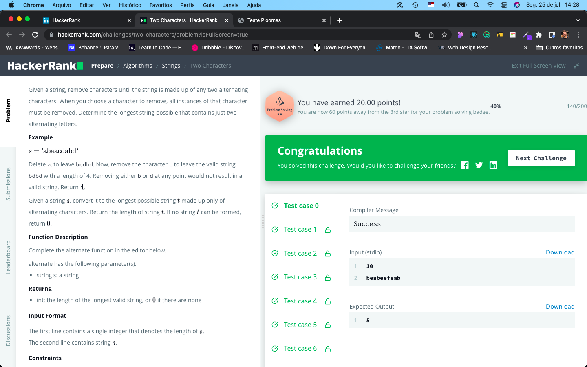
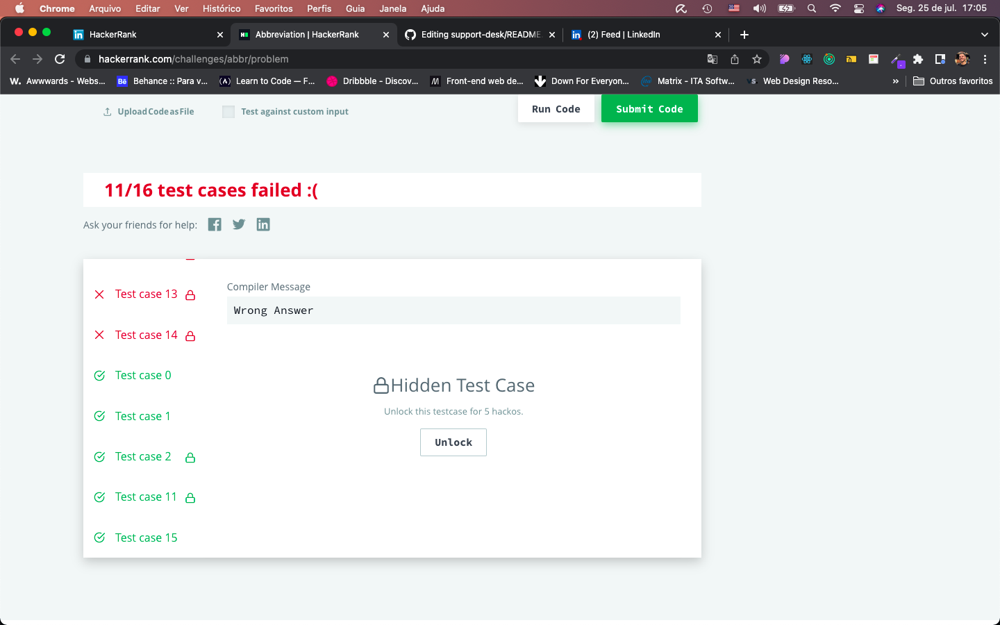

# Desafio PLOOMES HackerRank

Os dois algoritmos dos Desafios Two Characters e Abbreviation estão no arquivo script.js

## Two Characters

Este desafio foi tranquilo e consegui resolvê-lo sem problemas. Todos os testes do HackerRank foram realizados com sucesso.

## Abbreviation

Este desafio foi complicado porque nunca tinha trabalhado com programação dinâmica. Deveria ter tentado o outro mas fiquei muito envolvido nesse e, infelizmente, apenas 5 dos 16 testes foram validados.

Gostaria de agradecer a oportunidade!
